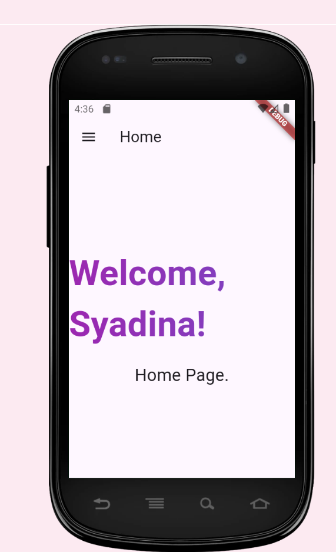
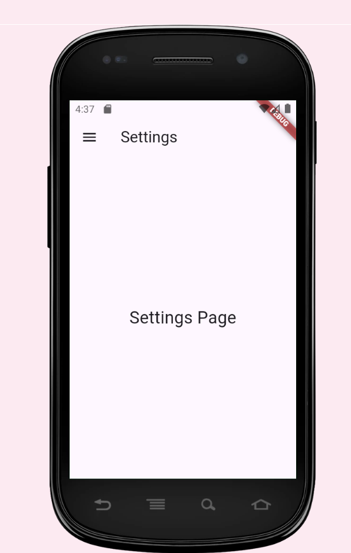
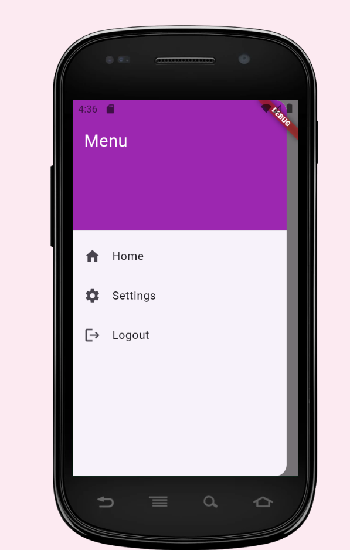

# tugas_3

SYADINA ZUFARIN AFIFAH
H1D021077

Gambaran Umum :
Aplikasi sederhana ini mengimplementasikan beberapa fitur seperti login, side menu, routing dan local storage.

Penjelasan :
1. Login Page : dapat melakukan login menggunakan username dan password. jika login berhasil, status login disimpan menggunakan local storage sehingga tidak perlu melakukan login ulang.
2. Home Page : Setelah melakukan login akan masuk ke halaman utama
3. Side Menu: Terdapat side menu sebagai navigasi antara halaman utama dan logout
4. Local Storage: Status login disimpan agar tetap dapat login saat aplikasi di-restart. 

Source Code:
1. Main Class - MyApp
   class MyApp extends StatelessWidget {
   @override
   Widget build(BuildContext context) {
   return MaterialApp(
   title: 'Flutter App with Routes and Animation',
   theme: ThemeData(
   primarySwatch: Colors.purple,
   visualDensity: VisualDensity.adaptivePlatformDensity,
   ),
   initialRoute: '/',
   routes: {
   '/': (context) => LoginPage(),
   '/home': (context) => HomePage(),
   '/settings': (context) => SettingsPage(),
   },
   );
   }
   }
Penjelasan :
a. MaterialApp: Aplikasi menggunakan widget MaterialApp, yang memuat routing, tema, dan navigasi.
b. initialRoute: Menentukan halaman awal, dalam hal ini adalah halaman login ('/').
c. routes: Menentukan rute untuk setiap halaman, mengarahkan string route (misalnya, /home) ke widget (misalnya, HomePage()).

2. Login Page -LoginPage
   class LoginPage extends StatefulWidget {
   @override
   _LoginPageState createState() => _LoginPageState();
   }

class _LoginPageState extends State<LoginPage> with SingleTickerProviderStateMixin {
final TextEditingController _usernameController = TextEditingController();
final TextEditingController _passwordController = TextEditingController();
bool _isLoggedIn = false;
late AnimationController _controller;
late Animation<double> _fadeAnimation;

@override
void initState() {
super.initState();
_checkLoginStatus();
_controller = AnimationController(vsync: this, duration: Duration(seconds: 1));
_fadeAnimation = Tween<double>(begin: 0.0, end: 1.0).animate(_controller);
_controller.forward();
}

Future<void> _checkLoginStatus() async {
SharedPreferences prefs = await SharedPreferences.getInstance();
bool loggedIn = prefs.getBool('isLoggedIn') ?? false;
if (loggedIn) {
Navigator.pushReplacementNamed(context, '/home');
}
}

Future<void> _login() async {
String username = _usernameController.text;
String password = _passwordController.text;

    if (username == 'user' && password == 'password') {
      SharedPreferences prefs = await SharedPreferences.getInstance();
      await prefs.setBool('isLoggedIn', true);
      Navigator.pushReplacementNamed(context, '/home');
    } else {
      _showLoginFailedDialog();
    }
}

void _showLoginFailedDialog() {
showDialog(
context: context,
builder: (context) {
return AlertDialog(
title: Text('Login Failed'),
content: Text('Incorrect username or password'),
actions: [
TextButton(
onPressed: () {
Navigator.pop(context);
},
child: Text('OK'),
),
],
);
},
);
}

@override
Widget build(BuildContext context) {
return Scaffold(
backgroundColor: Colors.purple[50],
appBar: AppBar(
title: Text('Login'),
),
body: FadeTransition(
opacity: _fadeAnimation,
child: Padding(
padding: const EdgeInsets.all(16.0),
child: Column(
mainAxisAlignment: MainAxisAlignment.center,
children: [
TextField(
controller: _usernameController,
decoration: InputDecoration(
labelText: 'Username',
border: OutlineInputBorder(),
prefixIcon: Icon(Icons.person),
),
),
SizedBox(height: 10),
TextField(
controller: _passwordController,
decoration: InputDecoration(
labelText: 'Password',
border: OutlineInputBorder(),
prefixIcon: Icon(Icons.lock),
),
obscureText: true,
),
SizedBox(height: 20),
ElevatedButton(
onPressed: _login,
child: Text('Login'),
style: ElevatedButton.styleFrom(
padding: EdgeInsets.symmetric(horizontal: 30, vertical: 10),
shape: RoundedRectangleBorder(
borderRadius: BorderRadius.circular(20),
),
backgroundColor: Colors.purple,
),
),
],
),
),
),
);
}
}
Penjelasan:
a. TextEditingController: Melakukan kontrol untuk input teks username dan password.
b. Local Storage: Menggunakan SharedPreferences untuk menyimpan status login. Jika sudah login, aplikasi akan melewatkan login page.
c. Animasi: FadeTransition digunakan untuk menampilkan halaman login dengan efek animasi fade-in.
d. Login Logic: Ketika login dengan username user dan password password, status login disimpan di local storage, dan diarahkan ke halaman Home.

3. Halaman utama -HomePage
   class HomePage extends StatelessWidget {
   @override
   Widget build(BuildContext context) {
   return Scaffold(
   appBar: AppBar(
   title: Text('Home'),
   ),
   drawer: SideMenu(),
   body: Center(
   child: Column(
   mainAxisAlignment: MainAxisAlignment.center,
   children: [
   AnimatedTextKit(
   animatedTexts: [
   ColorizeAnimatedText(
   'Welcome Home!',
   textStyle: TextStyle(
   fontSize: 50.0,
   fontWeight: FontWeight.bold,
   ),
   colors: [
   Colors.purple,
   Colors.blue,
   Colors.yellow,
   Colors.red,
   ],
   ),
   ],
   isRepeatingAnimation: true,
   onTap: () {},
   ),
   SizedBox(height: 20),
   Text(
   'This is your Home Page.',
   style: TextStyle(fontSize: 24),
   ),
   ],
   ),
   ),
   );
   }
   }
Penjelasan:
a. Animasi Teks: Menggunakan package animated_text_kit untuk menambahkan animasi teks yang menarik dan berwarna-warni.
b. Side Menu: Akses ke menu navigasi (SideMenu) dari drawer di halaman ini.

4. Side Menu
   class SideMenu extends StatelessWidget {
   @override
   Widget build(BuildContext context) {
   return Drawer(
   child: ListView(
   padding: EdgeInsets.zero,
   children: [
   DrawerHeader(
   decoration: BoxDecoration(
   color: Colors.purple,
   ),
   child: Text(
   'Menu',
   style: TextStyle(
   color: Colors.white,
   fontSize: 24,
   ),
   ),
   ),
   ListTile(
   leading: Icon(Icons.home),
   title: Text('Home'),
   onTap: () {
   Navigator.pushReplacementNamed(context, '/home');
   },
   ),
   ListTile(
   leading: Icon(Icons.settings),
   title: Text('Settings'),
   onTap: () {
   Navigator.pushReplacementNamed(context, '/settings');
   },
   ),
   ListTile(
   leading: Icon(Icons.logout),
   title: Text('Logout'),
   onTap: () async {
   SharedPreferences prefs = await SharedPreferences.getInstance();
   await prefs.setBool('isLoggedIn', false);
   Navigator.pushReplacementNamed(context, '/');
   },
   ),
   ],
   ),
   );
   }
   }
Penjelasan:
a. Drawer Header: Header di drawer berisi teks dan background ungu.
b. ListTile: Berfungsi sebagai tombol navigasi, seperti ke halaman Home, Settings, dan Logout.
c. Logout: Menghapus status login dari SharedPreferences dan mengarahkan untuk kembali ke halaman login.

5. Local Storage dengan SharedPreferences
   SharedPreferences prefs = await SharedPreferences.getInstance();
   await prefs.setBool('isLoggedIn', true);
Penjelasan:
a. SharedPreferences adalah cara untuk menyimpan data sederhana secara lokal, seperti status login. Di sini, status login disimpan menggunakan kunci 'isLoggedIn'.

Screenshoot Aplikasi:

   

   
